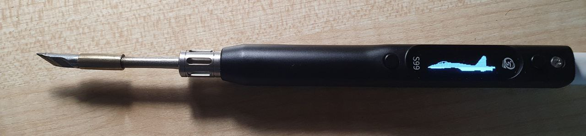

# 🔧 Changing the Image on Secure S99 Soldering Iron

## 📋 Instructions for Replacing the Image on the Soldering Iron Screen:

---

### 🅰️ Method A — Using `image_to_data.html`

To replace the image on the soldering iron screen, follow these steps:

✅ 1. Open **`image_to_data.html`** in your browser  
✅ 2. Draw the image you want to set  
✅ 3. Click **Copy** to copy the generated data array  
✅ 4. Run **`make_firmware.exe`**  
✅ 5. Paste the copied array into the console and press **Enter**

📦 If everything goes well, you'll see the message:  
**✅ New firmware file created successfully! Press any key to exit**

📁 A file named **`new_firmware.hex`** will appear in the folder

---

### 🔌 Flashing the Soldering Iron

✅ 1. Hold down the first button on the soldering iron  
✅ 2. Connect it to your computer  
✅ 3. Drag and drop **`new_firmware.hex`** onto the device  
⌛ Wait until the flashing process is complete

---

### 🅱️ Method B — Using `bitmaper.html` by AlexGyver

This method allows you to use an image (like a photo) as the boot logo.

#### 📷 Steps:

✅ 1. Open **`bitmaper.html`** in your browser  
✅ 2. In the **Процесс** section, select `8x Vertical Col`  
✅ 3. Upload an image and adjust brightness/contrast  
✅ 4. Click **Копировать** to copy the generated data array  
✅ 5. Run **`make_data.exe`**  
✅ 6. Paste the copied text into the console and press **Enter** twice  
✅ 7. Use the resulting array in **`make_firmware.exe`**

---

## 🗂️ Notes

- The original firmware file **`S99_V1.08.hex`** must be in the same folder as **`make_firmware.exe`**
- All changes are at your own risk 😄  
- Only compatible with **Secure S99**

---

## 💬 Thanks to [AlexGyver](https://github.com/AlexGyver) for **bitmaper.html**
